# Cool Tech Blog (Article Management System)

Welcome to the Cool Tech Blog project, a dynamic website built using the Laravel framework. This article management system was developed for Cool Tech, a company specialising in providing digestible technology information to the public. This was my first project for Cool Tech, who have since become consistent clients of mine.

## Project Overview

The Cool Tech Blog website offers a comprehensive platform for publishing and categorising technology-related articles. It includes the following main features:

-   **Home Page**: Displays the latest five articles with their titles and first paragraphs.
-   **Article View Page**: Shows detailed information about each article, including title, content, creation date, category and tags.
-   **Category and Tag View Pages**: List articles filtered by categories and tags.
-   **About Us and Legal Pages**: Provide information about Cool Tech and their terms of use and privacy policy.
-   **Search Page**: Allows users to search for articles by ID, category, or tag.
-   **Writer's Console**: A secure area for writers to submit articles.
-   **Admin Console**: A secure area for administrators to manage articles and categories.

## Key Features and Technologies

This project highlights my backend development skills using PHP, Laravel and SQL Server. Key aspects include:

-   Efficient database design with indexing for quick data retrieval.
-   Implementation of reusable components in Laravel for a consistent and maintainable codebase.
-   Use of middleware to secure writer and admin consoles.
-   Simple yet effective user interface design with basic HTML styling.

## Project Structure

```sh
cool-tech
├── README.md
├── app
│   ├── Http
│   │   ├── Controllers
│   │   │   ├── AdminConsoleController.php
│   │   │   ├── AuthController.php
│   │   │   ├── Controller.php
│   │   │   └── WriterConsoleController.php
│   │   └── Middleware
│   │       ├── EnsureAdminPasswordIsValid.php
│   │       ├── EnsureUserHasRole.php
│   │       └── EnsureWriterPasswordIsValid.php
│   ├── Models
│   │   ├── Article.php
│   │   ├── ArticleTag.php
│   │   ├── Category.php
│   │   ├── Tag.php
│   │   └── User.php
│   ├── Providers
│   │   └── AppServiceProvider.php
│   └── View
│       └── Components
│           └── Alert.php
├── artisan
├── bootstrap
├── composer.json
├── composer.lock
├── config
│   ├── app.php
│   ├── auth.php
│   ├── cache.php
│   ├── database.php
│   ├── filesystems.php
│   ├── logging.php
│   ├── mail.php
│   ├── queue.php
│   ├── services.php
│   └── session.php
├── database
│   ├── migrations
│   ├── seeders
│   │   └── DatabaseSeeder.php
│   └── sql
│       └── cool_tech.sql
├── docs
│   ├── cool_tech_ERD.pdf
│   └── screenshots
│       ├── admin-console.png
│       ├── admin-login.png
│       ├── article.png
│       ├── category.png
│       ├── footer.png
│       ├── homepage-article-list-feed.png
│       ├── legal-privacy-policy.png
│       ├── legal-terms-of-use.png
│       ├── role-selection.png
│       ├── search-articles.png
│       ├── tag.png
│       ├── writer-console.png
│       └── writer-login.png
├── package-lock.json
├── package.json
├── public
├── resources
│   ├── css
│   │   └── app.css
│   ├── js
│   │   ├── app.js
│   │   └── bootstrap.js
│   └── views
│       ├── about.blade.php
│       ├── admin
│       │   ├── admin-console.blade.php
│       │   └── admin-login.blade.php
│       ├── article.blade.php
│       ├── auth
│       │   └── login.blade.php
│       ├── category.blade.php
│       ├── components
│       │   └── alert.blade.php
│       ├── home.blade.php
│       ├── legal.blade.php
│       ├── search.blade.php
│       ├── tag.blade.php
│       ├── welcome.blade.php
│       └── writer
│           ├── writer-console.blade.php
│           └── writer-login.blade.php
├── routes
│   ├── console.php
│   └── web.php
└── storage
```

## Screenshots

To provide a visual overview of the project, here are some screenshots:

-   **Homepage Article List Feed**:
    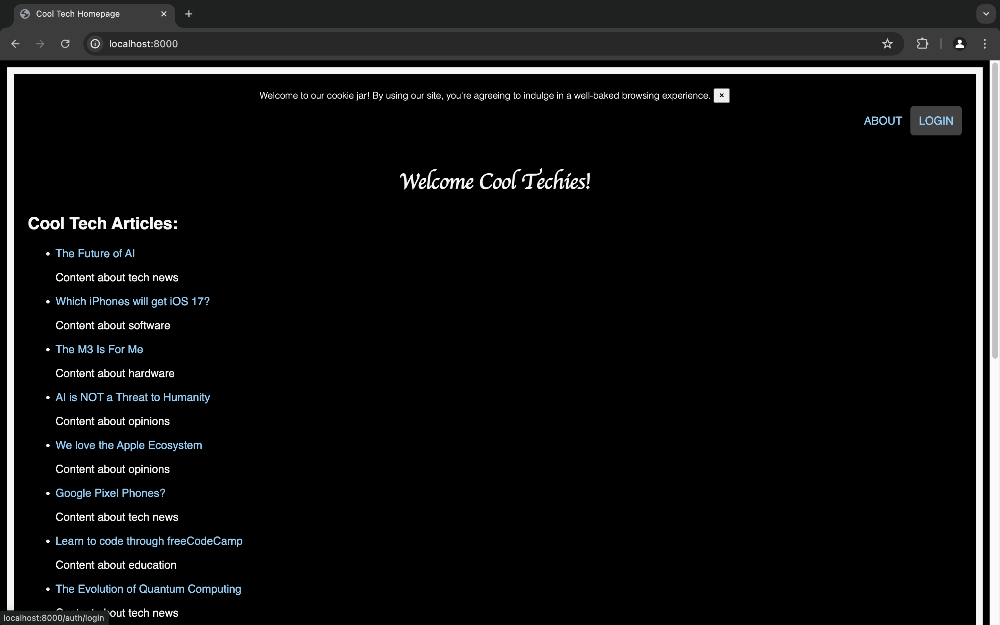

-   **Legal Privacy Policy**:
    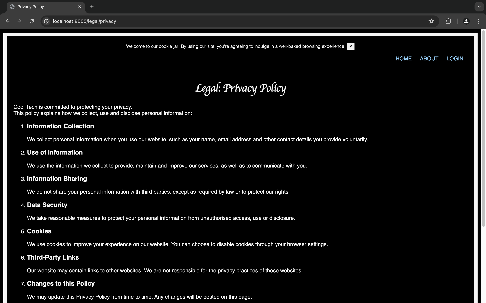

-   **Legal Terms of Use**:
    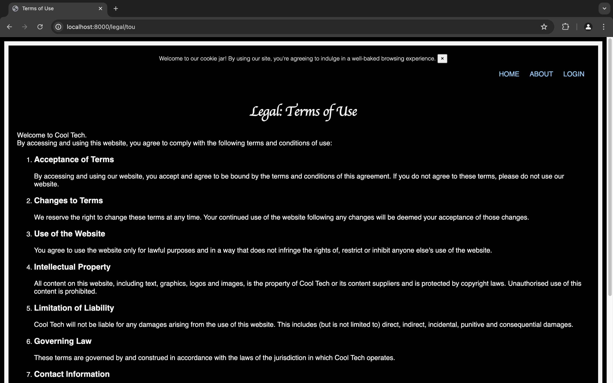

-   **Article View**:
    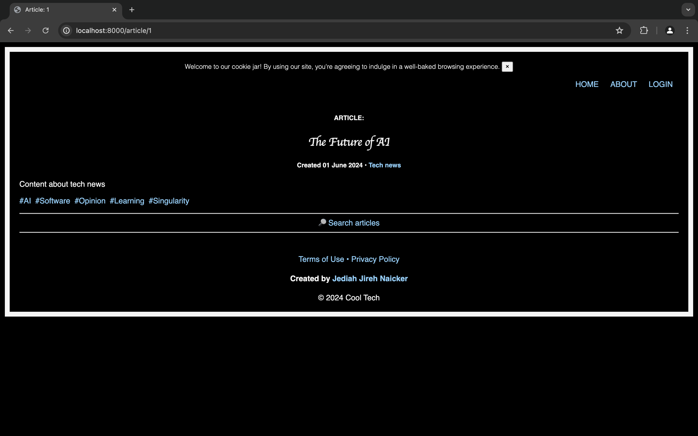

-   **Category View**:
    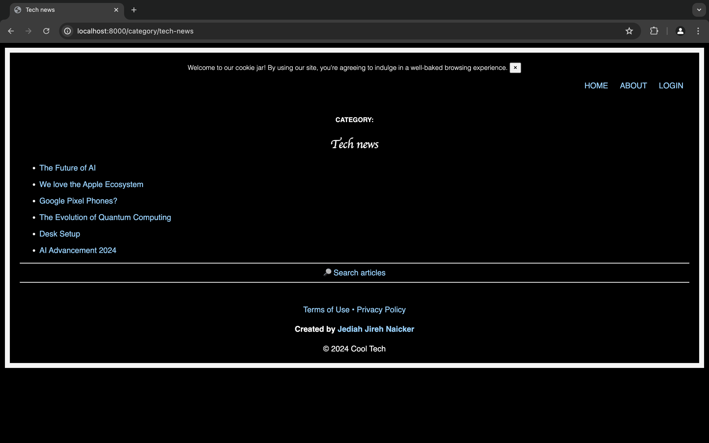

-   **Tag View**:
    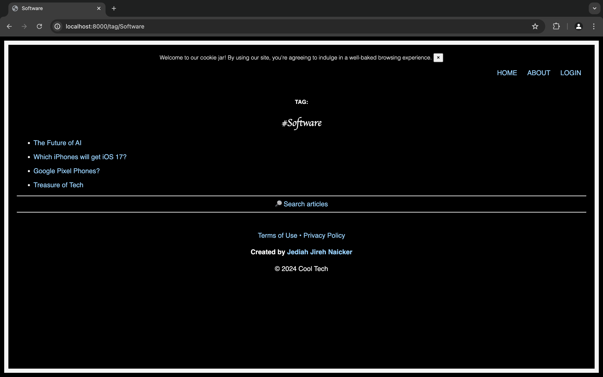

-   **Search Articles**:
    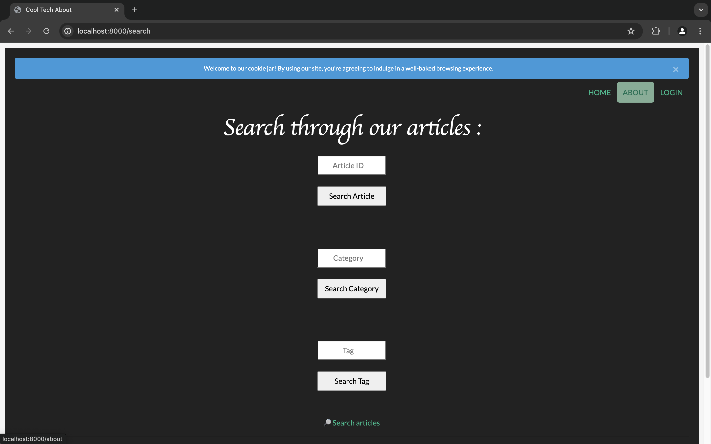

-   **Footer**:
    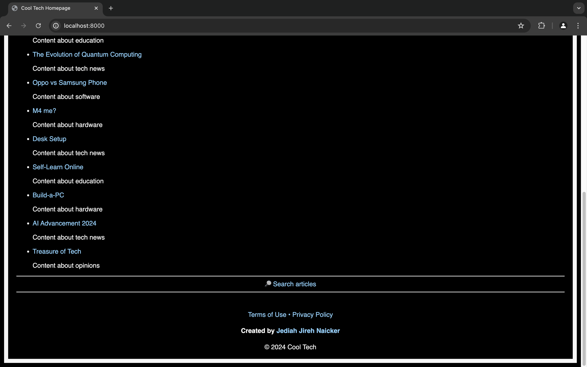

-   **Role Selection**:
    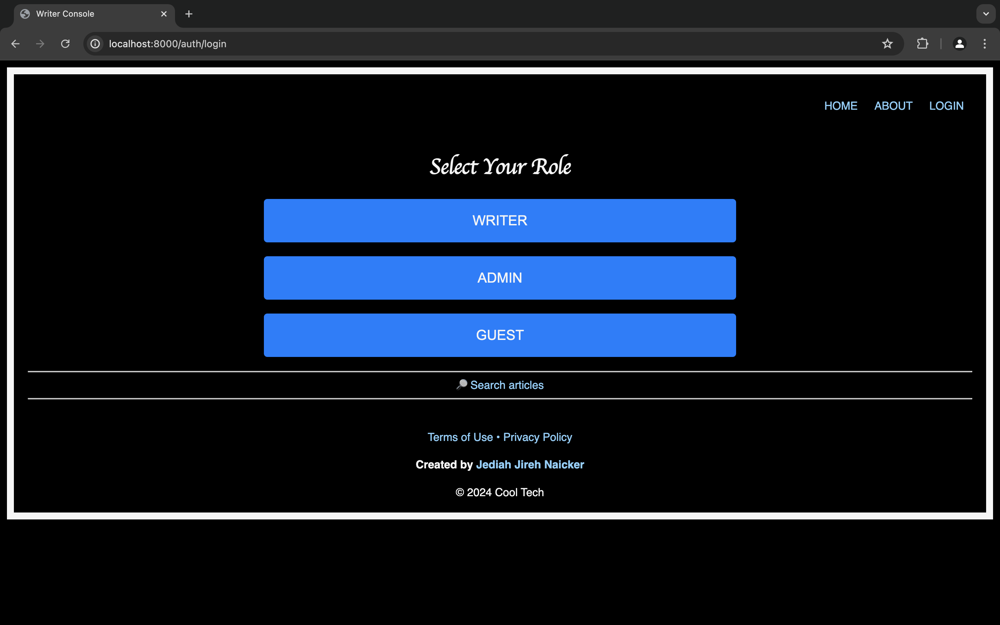

-   **Writer Console**:
    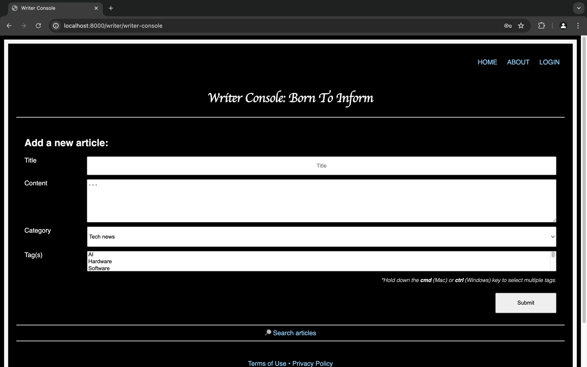

-   **Writer Login**:
    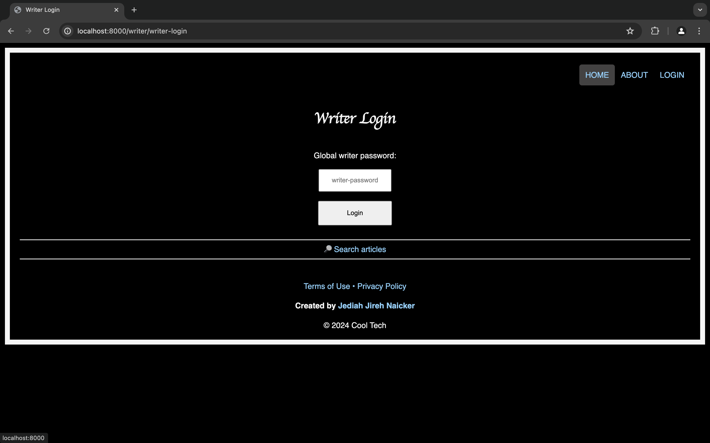

-   **Admin Console**:
    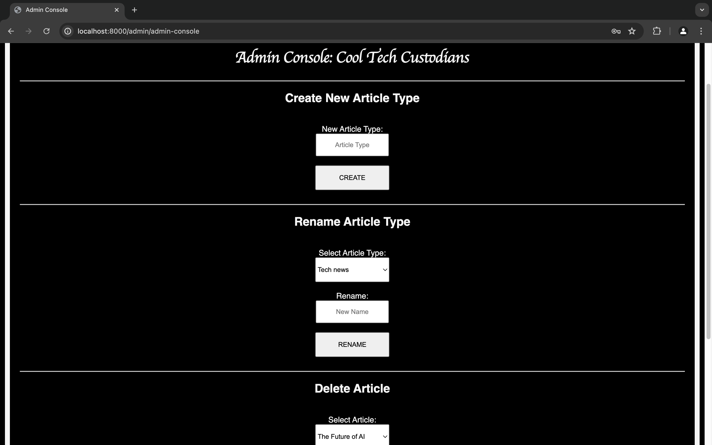

-   **Admin Login**:
    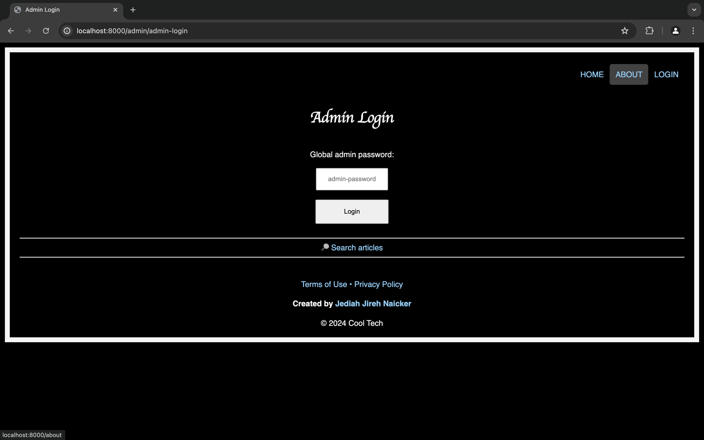

## Set Up

1. **Clone the Repository**:

    ```sh
    git clone https://github.com/jediahjireh/cool-tech.git
    ```

2. **Composer Dependencies**:

    - Laravel uses Composer to manage PHP dependencies. After cloning the repository, run:
        ```sh
        composer install
        ```
    - This command installs all the PHP dependencies specified in the `composer.json` file into the `vendor` directory.

3. **Node.js and npm Dependencies**:

    - Frontend assets are managed by npm. Install these dependencies by running:
        ```sh
        npm install
        ```
    - This installs all the JavaScript dependencies specified in the `package.json` file into the `node_modules` directory.

4. **Set Up the Environment**:

    - Create a `.env` file based on the `.env.example` file. Copy the example file and then update it with your environment-specific settings:
        ```sh
        cp .env.example .env
        ```
    - After copying, configure the `.env` file with appropriate values for database connections, application key, etc.
    - Ensure that the MySQL user 'laravel' has the necessary permissions.

5. **Application Key**:

    - Laravel requires an application key, which is typically set in the `.env` file. Generate this key if it's not already set:
        ```sh
        php artisan key:generate
        ```

6. **Run Migrations and Seeders**:

    - Start your MySQL server.
    - Run the migration:
        ```sh
        php artisan migrate
        ```
        Select 'Yes' when asked if you would like to create the database 'cool_tech'.
    - Run the seeder:
        ```sh
        php artisan db:seed --class=DatabaseSeeder
        ```

    Cool Tech's Blog [ERD](/docs/cool_tech_ERD.pdf)

7. **Start the Development Server**:
    - Open your preferred IDE (e.g. Visual Studio Code).
    - Go to `routes/web.php`.
    - Run the built-in Laravel server:
        ```sh
        php artisan serve
        ```
    - The project will be available at `http://localhost:8000` (unless the preset port is otherwise altered).

## Future Expansion

Cool Tech plans to integrate user authentication and session management, allowing for more advanced user interactions, such as user login, registration and personalised content management. For more details, please refer to the [client requests document](docs/cool_tech_blog_requests.pdf).

## Technologies Used

-   **PHP** with **Laravel**
-   **SQL Server** for database management
-   **CSS** for frontend styling
-   **Composer** for PHP dependencies
-   **NPM** for JavaScript dependencies

## Credits

Project created by: [Jediah Jireh Naicker](https://github.com/jediahjireh)

This article management system serves as a demonstration of my backend development capabilities using Laravel and PHP. I look forward to expanding and enhancing this project as Cool Tech's needs evolve.
Happy coding!
